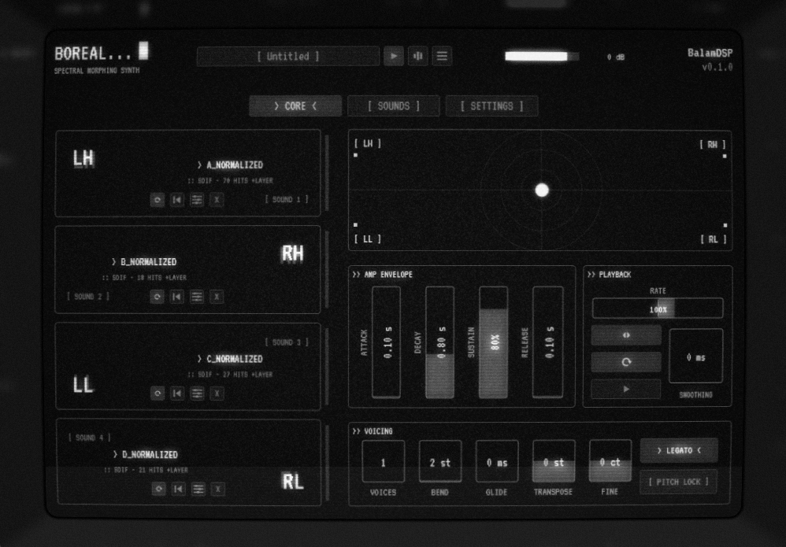

# Boreal — RBESM Morphing Synth

A VST3 / AU / CLAP / Standalone spectral morphing instrument by **BalamDSP**.
Loads four SDIF-analyzed sounds modeled with the Reassigned Bandwidth-Enhanced Additive 
Sound Model, allowing for real-time morphing between them using an XY control interface. 
The setup includes a transient attack layer and an integrated analysis window.

Formats: **VST3**, **AU** (macOS), **CLAP** + **Standalone** (JUCE 9, CMake).

<p align="center">
  
</p>

## Features

### Morph engine
- **Four-corner bilinear morph** over Loris analysis data.
- **Independent per-property blends** — pitch, loudness and brightness each
  follow their own morph position, plus a **Cross mode** (pitch from one
  corner, loudness from another) and per-slot **formant shift**.
- **Independent per-slot playheads** — rate, offset, loop window, direction
  and loop/one-shot per corner, repetitions drift async; reverse playback 
  and ping-pong supported.
- **Transpose / fine tune**, glide, legato, pitch bend and 1–8 voices.

### Transient layer
- **Raw-attack snippets** layered over the resynthesis at every detected
  onset, with complementary partial ducking, choke handling and an
  adjustable preserve/fade/window/pre-roll.

### Analysis window
- Drop in audio and get analyzed partials without a terminal: source and
  resynthesis waveforms, partials map, onset detection, clean-partials
  channelize/distill pass, SDIF + attack-sidecar export.

### Interface
- Fixed CRT panel with a toggleable **CRT overlay** based on cool-retro-term.

## Building

Requirements: CMake ≥ 3.22 and a C++17 compiler. JUCE 9.0.1 is fetched
automatically via CMake's FetchContent, the Loris fork
(`madrona-labs/loris`) likewise, and the CLAP wrapper
(`clap-juce-extensions`), likewise.

1. Check out the repository:

   ```sh
   git clone <url>
   ```

2. Configure and build:

   ```sh
   cmake -B build
   cmake --build build --config Release
   ```

3. Artifacts land in `build/Boreal_artefacts/`:
   - `VST3/Boreal.vst3`
   - `AU/Boreal.component` (macOS only)
   - `CLAP/Boreal.clap`
   - `Standalone/Boreal` (`.exe` on Windows, `.app` on macOS)

   When `BOREAL_COPY_AFTER_BUILD` is ON (the default) plugins are also
   copied into the platform's default system plugin folders.

## Third-party

| Component | Author | License |
|---|---|---|
| JUCE framework | JUCE Ltd | AGPLv3 |
| Loris library | Fitz & Haken | GPL-2.0-or-later |
| Vutu | Madrona Labs | GPLv3 |
| clap-juce-extensions | free-audio | MIT |
| cool-retro-term | Filippo Scognamiglio (Swordfish90) | GPL |
| VT323 typeface | Peter Hull | OFL |

## License

Boreal — Copyright (C) 2026 BalamDSP

This program is free software: you can redistribute it and/or modify it under
the terms of the GNU Affero General Public License as published by the Free
Software Foundation, either version 3 of the License, or (at your option) any
later version.

This program is distributed in the hope that it will be useful, but WITHOUT
ANY WARRANTY; without even the implied warranty of MERCHANTABILITY or FITNESS
FOR A PARTICULAR PURPOSE. See the GNU Affero General Public License for more
details. The full text is in [LICENSE.txt](LICENSE.txt) and at
<https://www.gnu.org/licenses/>.

Third-party components remain under their own licenses (table above).
